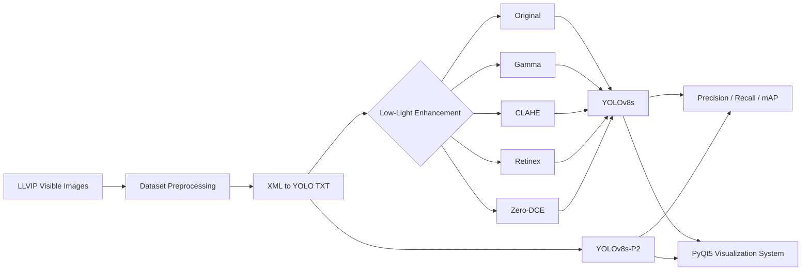
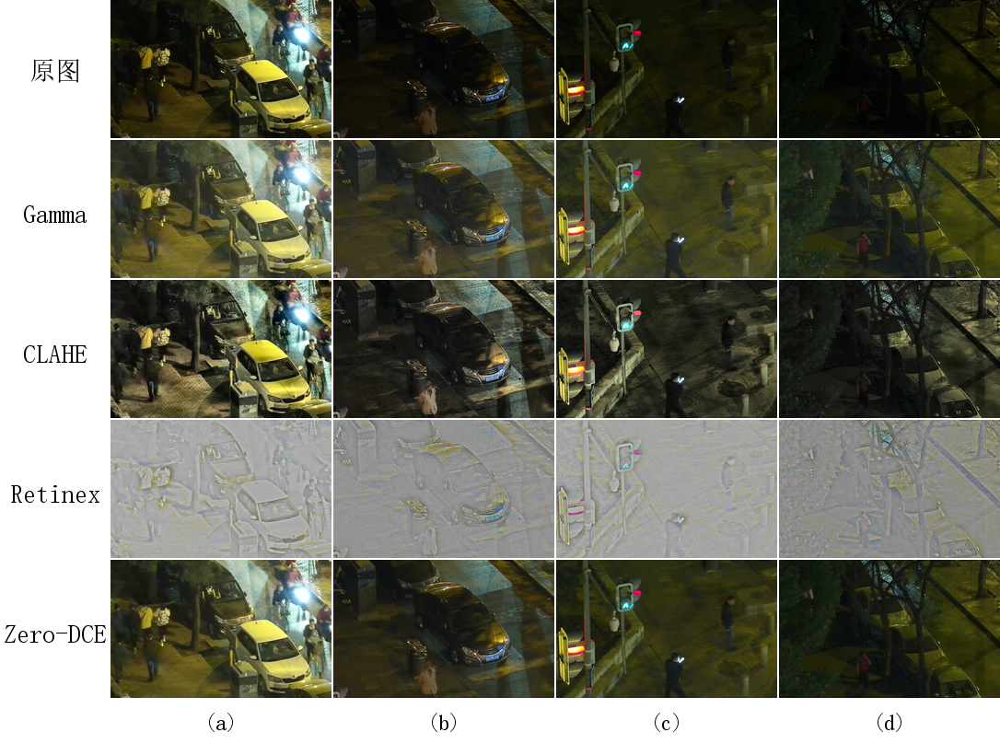

# Deep Learning-Based Nighttime Image Enhancement and Pedestrian Detection System

> 基于深度学习的夜间图像增强与行人检测系统  
> Undergraduate Graduation Project · Automation

本项目面向夜间低照度环境中的行人检测任务，重点研究 **低照度图像增强对下游目标检测性能的影响**，并在 YOLOv8s 基础上引入 **P2 高分辨率检测层**，提升模型对远距离、小尺度行人的感知能力。同时，项目基于 **Python + PyQt5 + OpenCV + Ultralytics YOLO** 实现了夜间图像增强与行人检测可视化系统。

项目实验基于 LLVIP 数据集的可见光夜间图像，比较了 **Gamma、CLAHE、Retinex、Zero-DCE** 四种增强方法，并对 **YOLOv5s、YOLOv8s、Faster R-CNN** 等检测模型进行了对比。

---

## 1. Research Motivation

夜间监控场景通常存在以下问题：

- 环境光照不足，行人与背景对比度较低；
- 行人轮廓、边缘和纹理细节不清晰；
- 远距离行人尺度较小，容易出现漏检；
- 复杂光照、噪声、阴影和局部强光会干扰模型判断；
- 图像“看起来更亮、更清晰”并不一定意味着目标检测精度更高。

因此，本项目从 **输入图像增强** 和 **检测网络结构改进** 两个方向展开研究，并进一步分析二者之间是否存在稳定的协同关系。

---

## 2. Main Contributions

本项目主要完成了以下工作：

1. 基于 LLVIP 可见光夜间图像构建行人检测数据集，并将 Pascal VOC XML 标注转换为 YOLO TXT 格式；
2. 对比 Gamma、CLAHE、Retinex 和 Zero-DCE 四种低照度图像增强方法；
3. 使用 YOLOv8s 分析不同增强方法对夜间行人检测性能的实际影响；
4. 对 YOLOv5s、YOLOv8s 和 Faster R-CNN 进行横向对比；
5. 在 YOLOv8s 的 P3/P4/P5 三尺度检测结构基础上增加 P2 高分辨率检测层，构建 YOLOv8s-P2 四尺度检测结构；
6. 开展图像增强方法与 YOLOv8s-P2 的交叉组合实验；
7. 基于 PyQt5、OpenCV 和 Ultralytics YOLO 实现图片/视频夜间行人检测可视化系统。

---

## 3. Overall Pipeline



---

## 4. Dataset

### 4.1 LLVIP

实验使用 **LLVIP (Low-Light Vision Pedestrian)** 数据集中的可见光夜间图像。

本项目只使用 Visible 模态，不使用红外图像，主要研究纯可见光条件下的夜间行人检测问题。

数据清洗与转换后：

| Split | Images |
|---|---:|
| Train | 12,023 |
| Validation | 3,463 |

原始 LLVIP 标注采用 Pascal VOC XML 格式，本项目通过 `scripts/01_prepare_dataset.py` 将其转换为 YOLO 所需的归一化 TXT 格式，并过滤不包含 `person` 目标的空样本。

### 4.2 Expected Dataset Structure

数据集体积较大，因此 **不会上传到 GitHub 仓库**。建议在项目根目录中按如下方式放置：

```text
LLVIPdata/
├── Annotations/
└── visible/
    ├── train/
    └── test/
```

运行预处理脚本后将生成：

```text
datasets/
└── LLVIP/
    ├── images/
    │   ├── train/
    │   └── val/
    └── labels/
        ├── train/
        └── val/
```

---

## 5. Low-Light Image Enhancement

项目比较了四种具有代表性的低照度图像增强方法：

| Method | Type | Characteristics |
|---|---|---|
| Gamma Correction | Traditional | 计算简单，可明显提升暗部亮度，但可能导致亮区过曝 |
| CLAHE | Traditional | 强化局部对比度和边缘细节，但可能放大颗粒噪声 |
| Retinex | Traditional | 基于光照/反射分量分离，部分夜间图像可能产生色偏 |
| Zero-DCE | Deep Learning | 无参考低照度增强，视觉效果通常更自然 |

### Visual Comparison



实验中观察到：**Zero-DCE 在主观视觉自然度方面表现较好，但视觉质量提升并不等价于检测精度提升。**

---

## 6. Object Detection Models

项目涉及以下检测模型：

### YOLOv5s

用于与 YOLOv8s 进行轻量级单阶段检测模型对比。

### YOLOv8s

作为本项目主要 Baseline 模型。其结构主要包括：

- Backbone：C2f + SPPF；
- Neck：PAN-FPN 多尺度特征融合；
- Head：Decoupled Head；
- Anchor-Free 检测机制。

### Faster R-CNN

作为双阶段目标检测模型，用于对比检测精度、模型规模和推理效率。

### YOLOv8s-P2

针对夜间小尺度、远距离行人容易漏检的问题，在 YOLOv8s 原有 P3、P4、P5 检测尺度之外增加 P2 高分辨率检测层：

```text
YOLOv8s:
P3 + P4 + P5

YOLOv8s-P2:
P2 + P3 + P4 + P5
```

P2 分支保留更多浅层空间细节，有助于捕获尺寸较小的行人目标，但同时也更容易受到夜间背景纹理和噪声的影响。

---

## 7. Experimental Setup

论文实验环境主要包括：

| Item | Configuration |
|---|---|
| OS | Ubuntu Linux |
| GPU | NVIDIA GeForce RTX 5090 |
| Python | 3.10 |
| PyTorch | 2.0 |
| CUDA | 12.8 |
| Input Size | 640 × 640 |
| Epochs | 50 |
| Optimizer | SGD |
| Initial Learning Rate | 0.01 |
| Momentum | 0.937 |
| Weight Decay | 0.0005 |
| Mixed Precision | AMP |

Baseline 训练脚本当前设置的 Batch Size 为 `64`。若显存不足，可根据实际硬件适当减小。

---

## 8. Experimental Results

### 8.1 Effect of Image Enhancement on YOLOv8s

| Input Dataset | mAP@0.5 (%) | Precision (%) | Recall (%) |
|---|---:|---:|---:|
| Original | 89.08 | **91.3** | 81.5 |
| **Gamma** | **89.59** | 90.1 | **83.5** |
| CLAHE | 87.86 | 89.2 | 80.2 |
| Retinex | 89.33 | **91.3** | 82.0 |
| Zero-DCE | 87.82 | 87.4 | 80.6 |

主要结论：

- Gamma 校正获得最高的 mAP@0.5，为 **89.59%**；
- 相比原始暗光图像，Gamma 的 Recall 从 81.5% 提升至 **83.5%**；
- Zero-DCE 的视觉自然度较好，但并没有带来更高的检测精度；
- CLAHE 和 Zero-DCE 可能由于噪声增强或特征分布变化，使检测性能下降；
- 夜间图像增强算法不能仅依靠人眼视觉效果评价，还需要结合下游检测任务。

---

### 8.2 Comparison of Different Detection Models

| Model | mAP@0.5 (%) | Params (M) | FPS* |
|---|---:|---:|---:|
| YOLOv5s | 89.10 | 9.1 | 1300 |
| YOLOv8s | 89.10 | 11.1 | 1250 |
| Faster R-CNN | 88.09 | 41.5 | 93.4 |

YOLOv5s 和 YOLOv8s 在保持较高检测精度的同时，具有更小的模型规模和更高的推理效率。综合后续结构改进的灵活性，本项目选择 **YOLOv8s** 作为主要 Baseline。

> \* FPS 与测试硬件、实现方式和统计方法强相关。仓库中的绘图脚本对 YOLO FPS 使用了估算值，因此该指标主要用于项目内部实验对比，不应视为跨平台通用性能。

---

### 8.3 YOLOv8s-P2 Ablation Study

| Model | mAP@0.5 (%) | mAP@0.5:0.95 (%) | Precision (%) | Recall (%) |
|---|---:|---:|---:|---:|
| YOLOv8s | 89.07 | **51.50** | 86.48 | 78.28 |
| **YOLOv8s-P2** | **89.43** | 50.86 | **90.22** | **79.03** |

加入 P2 检测层后：

- mAP@0.5 有小幅提升；
- Precision 和 Recall 均有所提升；
- 对部分远距离、小尺度行人的检测更有帮助；
- mAP@0.5:0.95 没有同步提高，说明高分辨率浅层特征也可能引入背景噪声，从而影响更严格 IoU 条件下的定位精度。

---

### 8.4 Enhancement × P2 Cross Experiments

| Dataset | YOLOv8s mAP@0.5 (%) | YOLOv8s-P2 mAP@0.5 (%) |
|---|---:|---:|
| Original | 89.08 | **89.43** |
| Gamma | **89.59** | 88.84 |
| CLAHE | **87.86** | 86.64 |
| Retinex | **89.33** | 88.47 |
| Zero-DCE | 87.82 | **88.11** |

结果表明：

> **图像增强与模型结构改进并不是简单叠加即可得到更优性能。**

P2 在 Original 和 Zero-DCE 数据上有所改善，但在 Gamma、CLAHE 和 Retinex 数据上 mAP@0.5 反而下降。这说明模型性能同时受到输入图像分布、增强方式、浅层特征质量和背景噪声等因素影响。

---

## 9. Visualization System

项目基于 `PyQt5 + OpenCV + Ultralytics YOLO` 实现桌面端可视化系统。

入口文件：

```text
demo/main_ui.py
```

系统主要支持：

- 手动加载训练得到的 `.pt` 模型；
- 单张夜间图片检测；
- MP4 / AVI 视频检测；
- 原图 / Gamma / CLAHE / Retinex / Zero-DCE 近似增强；
- 原始输入与处理后检测结果双窗口显示；
- 仅保留 `person` 类别检测结果；
- 置信度阈值动态调节；
- 默认置信度阈值 `0.25`，可调范围 `0.01 ~ 1.00`；
- 实时运行日志；
- 检测人数和推理耗时显示；
- 检测结果保存为 JPG / PNG；
- 视频连续处理与停止控制。

运行：

```bash
python demo/main_ui.py
```

启动后，请先通过界面加载训练得到的 `best.pt` 权重文件。

> 模型权重文件未直接上传到普通 Git 仓库。建议后续通过 GitHub Releases 或其他模型托管方式提供最终权重。

---

## 10. Project Structure

```text
Deep-Learning-Based-Nighttime-Image-Enhancement-and-Pedestrian-Detection-System/
│
├── demo/
│   └── main_ui.py
│
├── enhancement_comparison/
│   ├── baseline/
│   ├── Gamma/
│   ├── CLAHE/
│   ├── Retinex/
│   ├── Zero-DCE/
│   └── figure_compare_4imgs.png
│
├── detection_comparison/
│   ├── baseline/
│   ├── clahe/
│   ├── gramma/
│   ├── RETINEX/
│   └── Zero_DCE/
│
├── scripts/
│   ├── 01_prepare_dataset.py
│   ├── 02_train_baseline.py
│   ├── 03_train_yolov5.py
│   ├── 04_train_faster_rcnn.py
│   ├── 05_eval_faster_rcnn.py
│   ├── 06_plot_bubble_chart.py
│   ├── 07_compare_visual.py
│   ├── 08_test_zero_dce.py
│   ├── 09_eval_iqa.py
│   ├── 10_generate_datasets.py
│   ├── 11_train_enhanced_models.py
│   ├── 12_rescue_zerodce.py
│   ├── 13_train_yolov8_p2.py
│   ├── 14_train_all_experiments.py
│   └── configs/
│       ├── llvip.yaml
│       ├── llvip_clahe.yaml
│       ├── llvip_gamma.yaml
│       ├── llvip_retinex.yaml
│       ├── llvip_zerodce.yaml
│       └── yolov8s-p2.yaml
│
├── .gitignore
├── README.md
└── requirements.txt
```

---

## 11. Installation

推荐使用 Python 虚拟环境。

### Create Environment

```bash
python -m venv .venv
```

Windows:

```bash
.venv\Scripts\activate
```

Linux:

```bash
source .venv/bin/activate
```

### Core Dependencies

项目主要依赖：

```text
Python
PyTorch
torchvision
Ultralytics
OpenCV
NumPy
Matplotlib
PyQt5
tqdm
PyYAML
```

可先安装核心依赖：

```bash
pip install torch torchvision ultralytics opencv-python numpy matplotlib PyQt5 tqdm pyyaml
```

建议根据本机 GPU / CUDA 环境选择匹配的 PyTorch 版本。

---

## 12. Usage

### 12.1 Prepare LLVIP Dataset

将 LLVIP 数据放到项目根目录的 `LLVIPdata/` 中，并根据 `scripts/01_prepare_dataset.py` 检查数据路径。

由于部分实验脚本使用相对路径，建议运行前先进入 `scripts` 目录：

```bash
cd scripts
python 01_prepare_dataset.py
```

预处理完成后，将在项目根目录生成：

```text
datasets/LLVIP/
```

### 12.2 Train YOLOv8s Baseline

```bash
python 02_train_baseline.py
```

### 12.3 Train YOLOv5

```bash
python 03_train_yolov5.py
```

### 12.4 Train / Evaluate Faster R-CNN

```bash
python 04_train_faster_rcnn.py
python 05_eval_faster_rcnn.py
```

### 12.5 Generate Enhanced Datasets

```bash
python 10_generate_datasets.py
```

### 12.6 Train Models on Enhanced Datasets

```bash
python 11_train_enhanced_models.py
```

### 12.7 Train YOLOv8s-P2

```bash
python 13_train_yolov8_p2.py
```

### 12.8 Run Visualization System

从项目根目录执行：

```bash
python demo/main_ui.py
```

> 部分训练脚本中的数据集路径和 YAML 路径与本地实验目录相关。复现实验前请先检查脚本顶部配置项，并根据本机目录结构进行调整。

---

## 13. Key Findings

本项目最重要的实验结论不是“增强一定可以提高检测效果”，而是：

**Human-perceived visual quality and detector-oriented image quality are not equivalent.**

即：

- 更亮、更自然的图像不一定带来更高的 mAP；
- Gamma 校正在本实验中对 YOLOv8s 最有效；
- Zero-DCE 主观观感较好，但检测性能未同步提升；
- P2 高分辨率检测层可以改善部分小目标检测，但会增加浅层噪声敏感性；
- 图像增强和检测网络结构改进之间不存在稳定的简单叠加关系。

这一结果说明，面向夜间目标检测的图像增强方法应更多考虑 **下游视觉任务特征**，而不仅仅追求人眼观感。

---

## 14. Limitations and Future Work

未来可进一步研究：

- 扩展雨雾、车灯眩光、积水反光、运动模糊、遮挡等复杂夜间场景；
- 将图像增强网络与目标检测网络进行联合训练；
- 在增强阶段引入检测损失，使增强结果更有利于行人识别；
- 优化 YOLOv8s-P2 的特征融合路径；
- 引入 CBAM、SE、Coordinate Attention、SimAM 等注意力机制；
- 研究模型剪枝、知识蒸馏、量化等轻量化方法；
- 利用 LLVIP 的 Visible + Infrared 双模态信息开展 RGB-IR 融合行人检测；
- 进一步完善桌面系统并探索边缘设备部署。

---

## 15. Notes

- LLVIP 原始数据集未包含在本仓库中；
- `.pt` / `.pth` 等模型权重默认由 `.gitignore` 忽略；
- 训练输出、缓存文件和大型数据集不建议直接提交到普通 Git 仓库；
- 若公开最终模型，建议使用 GitHub Releases 或专门的模型托管平台；
- 本项目主要用于本科毕业设计、计算机视觉学习与实验复现。

---

## 16. Academic Use

如果本项目中的代码、实验流程或结果对你的学习或研究有帮助，请在使用时注明来源。

**Project:** Deep Learning-Based Nighttime Image Enhancement and Pedestrian Detection System  
**Author:** Xu Yang  
**Major:** Automation

---

## 17. License

当前仓库暂未声明开源许可证。

在未添加明确 License 之前，本仓库代码不默认授予复制、修改、分发或商业使用权限。如需使用，请先联系项目作者。

---

## Acknowledgements

感谢 LLVIP 数据集、PyTorch、Ultralytics YOLO、OpenCV、PyQt5 等开源项目与工具对本项目研究和系统开发提供的支持。
